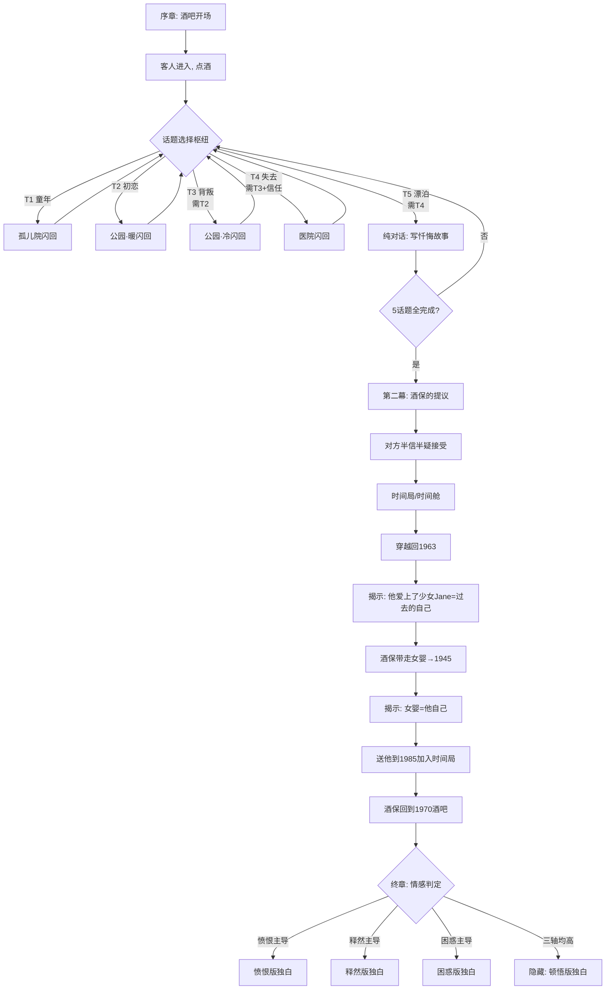

# 《All You Zombies》游戏设计文档

> 阶段1.2 交付物。基于 `story_analysis.md` 的结构分析，定义游戏的具体机制。
> 所有对话、独白均为**原创戏剧化改编**，不复制原著文本。

---

## 0. 游戏总体框架

- **玩家身份**：酒保（即主角的未来形态，全知者）
- **核心循环**：在酒吧选择"问什么话题" → 触发对应闪回 → 回到酒吧继续
- **戏剧反讽**：玩家（酒保）早已知道真相，却引导对方讲出"他自己的"故事
- **通关时长**：2-4小时
- **结局**：3种情感结局 + 1个隐藏结局

游戏分为五幕：

| 幕 | 名称 | 内容 | 机制 |
|----|------|------|------|
| 序章 | 打烊之前 | 酒吧开场，建立氛围，客人进入 | 线性 + 少量选择 |
| 第一幕 | 倾听 | 5个话题块自由探索，触发闪回 | 对话树 + 闪回 |
| 第二幕 | 提议 | 酒保提出"带你回到过去" | 线性，世界观揭示 |
| 第三幕 | 穿越 | 时间旅行，闭环揭示 | 线性 + 揭示演出 |
| 终章 | 衔尾蛇 | 酒保独白，结局分支 | 情感系统判定 |

---

## 1. 酒吧对话树（第一幕核心）

### 1.1 话题块设计

第一幕的核心是5个话题块。玩家选择询问顺序，但**深层话题需要"信任度"解锁**——
酒保通过共情式回应建立信任，对方才愿意揭开更痛的伤疤。

| 话题块 | 对应人生阶段 | 触发闪回 | 解锁条件 | 主导情感倾向 |
|--------|--------------|----------|----------|--------------|
| T1 童年 | 孤儿院 (1945-63) | 孤儿院 | 初始可用 | 困惑 |
| T2 初恋 | 公园相遇 (1963春) | 公园·暖 | 初始可用 | 释然 |
| T3 背叛 | 被抛弃 (1963) | 公园·冷 | T2完成后 | 愤恨 |
| T4 失去 | 医院/变性 (1964) | 医院 | T3完成 + 信任≥3 | 愤恨/困惑 |
| T5 漂泊 | 现在 (1964-70) | 无（纯对话） | T4完成 | 困惑/释然 |

**信任度（trust）**：隐藏数值，0-10。通过共情式对话选项累积。某些深入追问需要
信任门槛，否则对方会回避（"你不会懂的"）。

### 1.2 对话树流程图



### 1.3 话题块内部结构（以T2初恋为例）

每个话题块 = 酒吧对话（引导）→ 闪回（沉浸演出）→ 回到酒吧（反应+情感选择）。

```
[酒吧] 酒保问起那段感情
   └─ 选择: 如何开口问？
        a) "你爱过什么人吗？"（温和）→ trust+1, acceptance+1
        b) "那个男人是谁？"（直接）→ resentment+1
        c) 沉默，只是给他续酒（共情）→ trust+2, bewilderment+1
[闪回·公园·暖] 1963春，Jane在公园遇见那个男人
   └─ 演出: 相遇、交谈、第一次被理解、初吻（CG-02, CG-03）
   └─ 这是Jane一生中最幸福的时刻（明亮暖调）
[回到酒吧] 对方讲述时的神情
   └─ 选择: 酒保（玩家）的内心反应
        a) "我比谁都懂那种感觉。"（暗示同一性）→ bewilderment+2
        b) 为他感到心痛 → acceptance+1
        c) "然后呢？他怎么了？"（推进）→ 解锁T3
```

---

## 2. 闪回触发映射表

| 闪回ID | 名称 | 时代/调色 | 场景背景 | 关键CG | 触发话题 |
|--------|------|-----------|----------|--------|----------|
| FB-01 | 孤儿院门口 | 1945 / 冷灰蓝留微光 | BG孤儿院外观+内部 | CG-01 婴儿被弃 | T1 |
| FB-02 | 公园初恋 | 1963春 / 柔金嫩绿樱粉 | BG公园长椅·春 | CG-02 相遇, CG-03 初吻 | T2 |
| FB-03 | 公园诀别 | 1963 / 褪色金灰蓝 | BG公园长椅·夜 | CG-04 空长椅 | T3 |
| FB-04 | 医院觉醒 | 1964 / 消毒白冷青 | BG医院走廊+病房 | CG-05 手术台, CG-06 婴儿被抱走 | T4 |
| FB-05 | 雨夜街道 | 1964 / 湿冷霓虹 | BG街道雨夜 | CG-07 独行 | T4尾声 |
| FB-06 | 时间舱 | 1970设施 / 钢蓝铬灰 | BG时间旅行实验室 | CG-08 启动 | 第二幕 |
| FB-07 | 时间漩涡 | 抽象 / 琥珀深蓝漩涡 | BG时间漩涡 | CG-09 记忆碎片重叠 | 第三幕 |
| FB-08 | 闭环之晨 | 1945 / 同FB-01 | BG孤儿院门口 | CG-10 酒保放下婴儿 | 第三幕 |

**转场设计**：进入闪回用"画面褪色→旧照片颗粒感→浸入"；返回酒吧用"褪色回暖→
酒吧灯光重现"。跨时代用 `im.matrix` 色调滤镜平滑过渡，强化穿越感。

---

## 3. 三轴情感系统

### 3.1 三轴定义

| 轴 | 变量名 | 含义 | 对应的世界观态度 |
|----|--------|------|------------------|
| 愤恨 | `resentment` | 对命运/加害者/宇宙的愤怒 | "这一切是个诅咒，我要反抗" |
| 释然 | `acceptance` | 接纳、理解、与自己和谈 | "这就是我，我接受这个环" |
| 困惑 | `bewilderment` | 存在性眩晕、质疑现实 | "这怎么可能？我到底是什么？" |

### 3.2 数值规则

- 初始值：`resentment=0, acceptance=0, bewilderment=0`
- 每个选择对1-2个轴 ±1~3
- 全程约25-35个情感选择点
- 预期通关时单轴累积范围约 8-20

### 3.3 选择点分布（示例，完整表在剧本中）

| 选择点 | 选项 | 情感增减 |
|--------|------|----------|
| 序章·如何打量客人 | "又一个失意人" | resentment+1 |
| | "他眼里有种熟悉的东西" | bewilderment+2 |
| | "今晚我会好好听他说" | acceptance+1 |
| T1·听到被遗弃 | "谁这么狠心" | resentment+2 |
| | "也许那是命运的安排" | acceptance+1, bewilderment+1 |
| T3·听到被抛弃 | "那个男人该死" | resentment+3 |
| | "他真的懂你吗" | bewilderment+2 |
| T4·听到变性 | "他们怎么能这样对你" | resentment+2 |
| | "你终于成为了自己" | acceptance+2 |
| 第三幕·面对闭环 | "这是个残酷的玩笑" | resentment+3 |
| | "原来我一直是我自己" | acceptance+3 |
| | "这不可能……这怎么可能" | bewilderment+3 |

### 3.4 信任度（trust）独立系统

- 范围 0-10，仅由"共情式"选项增加
- 作用：解锁T4（需trust≥3）、解锁某些深入追问、影响对方袒露程度
- 信任度高时，对方会说出更多内心话（额外文本），增强沉浸

---

## 4. 结局判定与四种结尾

### 4.1 判定逻辑（终章开始时计算）

```python
# 隐藏结局优先：三轴均达到"深刻理解"阈值
if resentment >= 12 and acceptance >= 12 and bewilderment >= 12:
    ending = "epiphany"   # 顿悟版（隐藏）
else:
    # 否则取主导轴
    dominant = max(resentment, acceptance, bewilderment)
    if dominant == resentment: ending = "rage"
    elif dominant == acceptance: ending = "peace"
    else: ending = "vertigo"
```

### 4.2 四种结尾独白基调

| 结局 | 触发 | 独白基调 | 最终意象 |
|------|------|----------|----------|
| **愤恨版** (rage) | resentment主导 |  against the loop，砸碎酒杯，怒吼"我不接受" | 蛇衔尾，但蛇在挣扎撕咬 |
| **释然版** (peace) | acceptance主导 | 平静斟酒，"我就是我自己的家" | 蛇衔尾，安详闭环，暖光 |
| **困惑版** (vertigo) | bewilderment主导 | 眩晕独白，"你们这些僵尸从哪来" | 蛇衔尾，但在无限镜面中碎裂复制 |
| **顿悟版** (epiphany) | 三轴均≥12 | 超越三者，既愤怒又接纳又眩晕，最终归于"我即是环本身" | 蛇衔尾化为光环，所有形态重叠微笑 |

**机制即隐喻**：无论玩家怎么选，闭环都闭合（剧情不变）；但玩家的情感态度决定了
酒保如何"理解"这个环——这是对"宿命 vs 自由意志"主题的机制化表达：事件无法改变，
但意义由态度赋予。

---

## 5. 七处"微妙相似"暗示线索

供细心玩家提前察觉"所有角色是同一人"。收集全部解锁画廊彩蛋。

| # | 位置 | 暗示内容 | 类型 |
|---|------|----------|------|
| 1 | 序章 | 酒保打量客人："他的眼睛……灰绿色的，像在哪里见过。" | 视觉（眼睛） |
| 2 | T1闪回 | 婴儿被抱起时，眉尾有一道极细的胎记 | 视觉（眉疤） |
| 3 | T2闪回 | Jane描述那个男人"他握杯子的姿势和我一模一样" | 行为（习惯） |
| 4 | T2酒吧 | 客人写字时，酒保瞥见笔迹——和自己写的一模一样 | 视觉（笔迹） |
| 5 | T3闪回 | 那个男人消失前说"我们其实是一类人" | 对话（双关） |
| 6 | T4酒吧 | 客人说"我总觉得我身体里住着另一个人" | 对话（直指） |
| 7 | 第三幕 | 时间漩涡中，所有形态的剪影重叠为一 | 视觉（终极暗示） |

**线索UI**：发现线索时屏幕边缘闪过微光 + 轻柔音效，记入"线索笔记"。集齐7条在
画廊解锁一张特殊CG（所有形态并排，共享同一双灰绿眼）。

---

## 6. 角色与立绘需求（对接阶段3）

| 形态 | 立绘表情数 | 时代调色 | 备注 |
|------|-----------|----------|------|
| Jane（少女） | 3（平静/愤怒/悲伤）+ 1微笑（初恋） | 1963暖 | 明确女性 |
| John/叙述者 | 3（苦涩/愤怒/茫然） | 1970阴暗 | 男性外表+女性暗示 |
| 酒保 | 3（沉稳/悲悯/苦笑） | 1970阴暗 | 男性，更年长 |
| 老人 | 2（疲惫/释然） | 1993暮色 | 男性老年 |
| 公园里的男人 | 复用John立绘（逆光剪影处理） | 1963 | 不单独画，保持神秘 |

---

## 7. 音频接口预留（用户后续填充）

| 场景 | BGM建议风格 | 文件占位 |
|------|-------------|----------|
| 酒吧（主） | 冷爵士/低音萨克斯，慵懒阴郁 | `audio/bgm/bar_main.ogg` |
| 公园初恋 | 暖弦乐/钢琴，浪漫 | `audio/bgm/park_love.ogg` |
| 公园诀别 | 同上变奏，转小调 | `audio/bgm/park_loss.ogg` |
| 医院 | 极简氛围/心跳，临床冷感 | `audio/bgm/hospital.ogg` |
| 时间旅行 | 复古合成器/电子，冰冷科技感 | `audio/bgm/timetravel.ogg` |
| 终章独白 | 单一钢琴/弦乐，依结局变奏 | `audio/bgm/ending_*.ogg` |

音效占位：酒杯、雨声、转场whoosh、时间舱启动、线索发现叮。

---

## 7.5 隐藏结局新增美术需求（1993未来线）

隐藏结局（顿悟版）专属的1993年未来线，需要两个新资源，展示全剧唯一未出现过的暮色暖灰调：

| 资源 | 类型 | 时代调色 | 描述 |
|------|------|----------|------|
| `bg room_1993` | 背景 | 暖灰 + 暮色金，疲惫的平静 | 1993年一间不大的房间，窗外暮色，金色而疲惫的光落在旧地板上。全剧最安静、最苍凉的色调 |
| `cg scar` | 事件CG | 同上， intimate 特写 | 老人腹部一道剖腹产旧疤的特写，几十年未愈，"像一张永远不会愈合的嘴"。暮色光线下，手指轻触。极具情感冲击的私密画面 |

配乐占位：`audio/bgm/room_1993.ogg`（极简、苍凉的暮色氛围，可单一乐器）。

---

## 8. 下一步

阶段1.3 将基于本文档撰写完整中文剧本，结构为：
- `ch0_prologue.rpy` 序章
- `ch1_listening.rpy` 第一幕（5话题块 + 闪回）
- `ch2_offer.rpy` 第二幕
- `ch3_jump.rpy` 第三幕
- `ch4_ending.rpy` 终章（4版本独白）

每个选择点标注情感增减，每个闪回标注CG/背景需求，便于阶段3美术对接。

---

*文档版本 v1.0 | 阶段1.2 交付物 | 2026-07-21*
